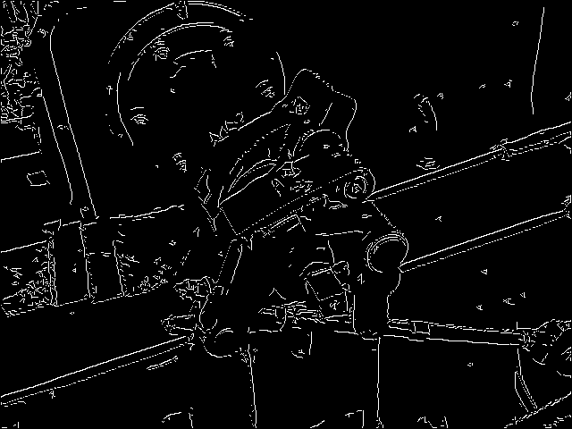

# Feature Detection Implementation using OpenCV C++

### Description
Application includes Edge Detection, Corner Detection and Key Feature Detection

## Prerequisites

- [CMake](https://cmake.org/download/) (version 3.6.0 or higher)
- [OpenCV](https://opencv.org/releases/) (ensure the path is correctly set in `CMakeLists.txt`)
- A C++ compiler (Visual Studio 2022, GCC, Clang, etc.)

## Building the Project

### Clone the Repository

```sh
git clone https://github.com/yourusername/EdgeDetector.git
cd EdgeDetector
```

### Build the project
- Build visual studio solution in build folder
```sh
mkdir build
cd build
cmake ..
```
- Open project in visual studio using the EdgeDetector.sln file and build the solution.

## Run application
- After building the project and solution, navigate to /build/Debug folder
- Run the executable file
```sh
.\EdgeDetector.exe -<arg> <input-path> <output-path> -<other-args>
```
- It is recommended to place input image in 'images' folder of the repo and set input path to the 'images' folder and output path to 'results' folder for running command.

## Edge Detector
- Sobel
```sh
.\EdgeDetector.exe -sobel "path/to/repo/images" "path/to/repo/results"
```
Original | Sobel Edge
:--------------------------:|:--------------------------:
 | 

- Laplace
```sh
.\EdgeDetector.exe -laplace "path/to/repo/images" "path/to/repo/results"
```
Original | Laplace Edge
:--------------------------:|:--------------------------:
 | 

- Canny
```sh
.\EdgeDetector.exe -canny "path/to/repo/images" "path/to/repo/results" <min-gradient> <max-gradient>
```
Original | Canny Edge (min-gradient = 100 & max-gradient = 150)
:--------------------------:|:--------------------------:
 | 

## Corner Detector
- Harris
```sh
.\EdgeDetector.exe -harris "path/to/repo/images" "path/to/repo/results" <block-size> <aperture-size> <k>
```
k between 0.04 and 0.06 is recommended
Original | Harris corner (block-size = 5 & aperture-size = 3 & k = 0.04)
:--------------------------:|:--------------------------:
 | 

## Feature Detector
- SIFT
```sh
.\EdgeDetector.exe -sift "path/to/repo/images" "path/to/repo/results" <contrast-threshold>
```
Original | SIFT Keypoints (constrast-threshold = 0.025) | SIFT Keypoints (constrast-threshold = 0.025 and different orientation)
:-------------------------:|:-------------------------:|:------------------------:
 |  | 
